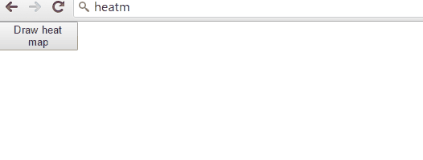
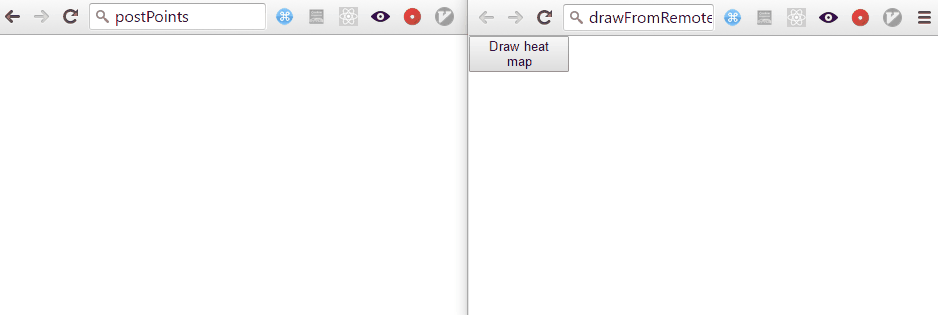

# heatm

javascript heatmap



``` npm install heatm ```

Local test at /examples/onMemoryLocalDraw/index.html

In order to test the remote post/get drawing run:

``` node examples/serverTests/index.js ```

Then open in your browser the following two files:

* examples/postPoints/index.html
* examples/drawFromRemote/index.html

Preview:



***Client post script example***
```
var hmap = heatm({
  postPointsUrl:'http://localhost:3000/setPoints',
  postPointsBatch: 50,
  maxPointsToPost: 500,
  projectName:'default'
});

hmap.startPostingPoints();
```
(there are more configurations you can see at src/modules/main.js)

hmap begins posting arrays of points to the server, also a project name is sent along the user screen dimensions. The logic to storage the data is server side responsibility, there is an on memory example at examples/serverTests/index.js.

***Client draw from remote example***
```
var hmap = heatm({
  projectName:'default',
  getPointsUrl:'http://localhost:3000/getPoints',
  getPointsBatch: 50
});

hmap.drawHeatMapFromRemote();

```
